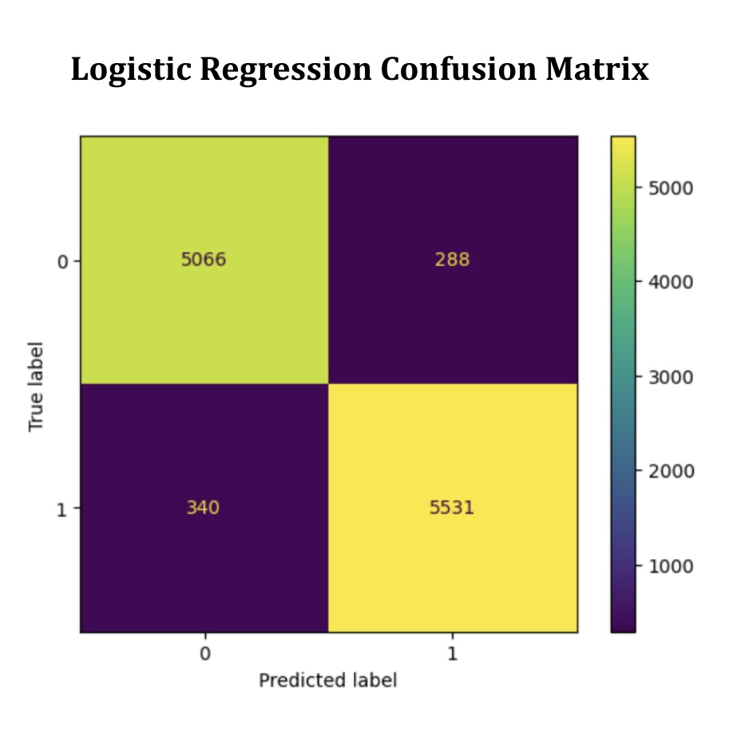
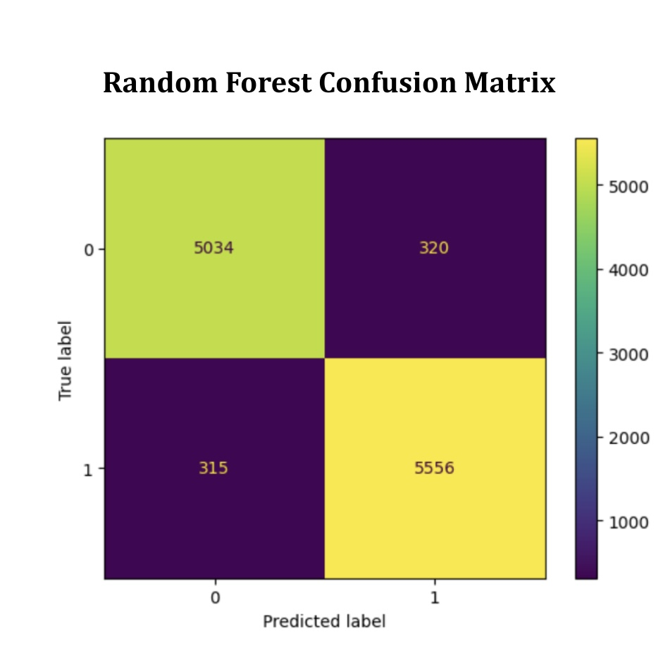
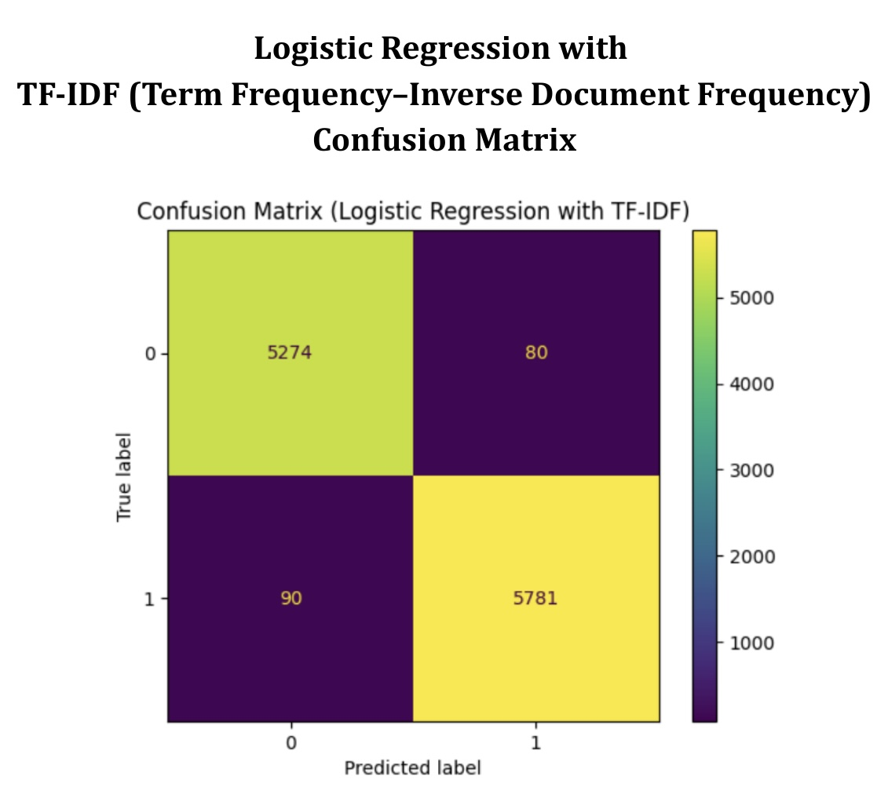
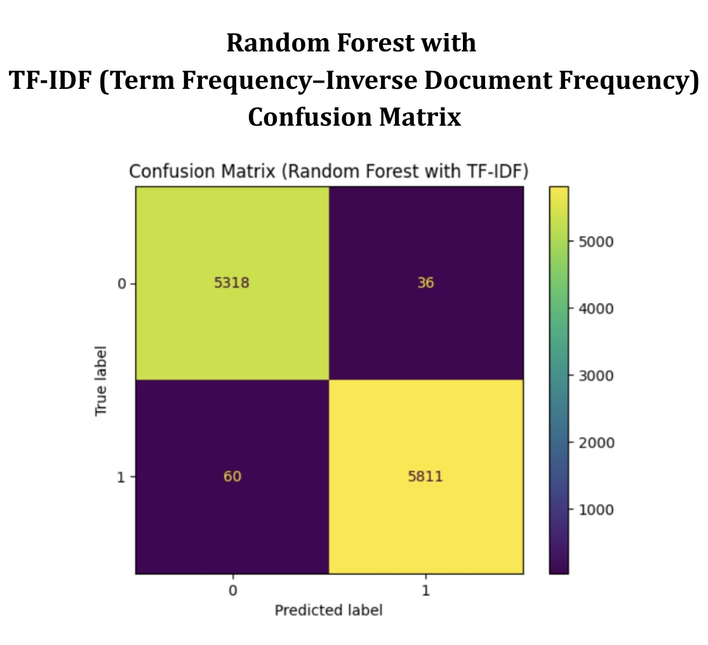
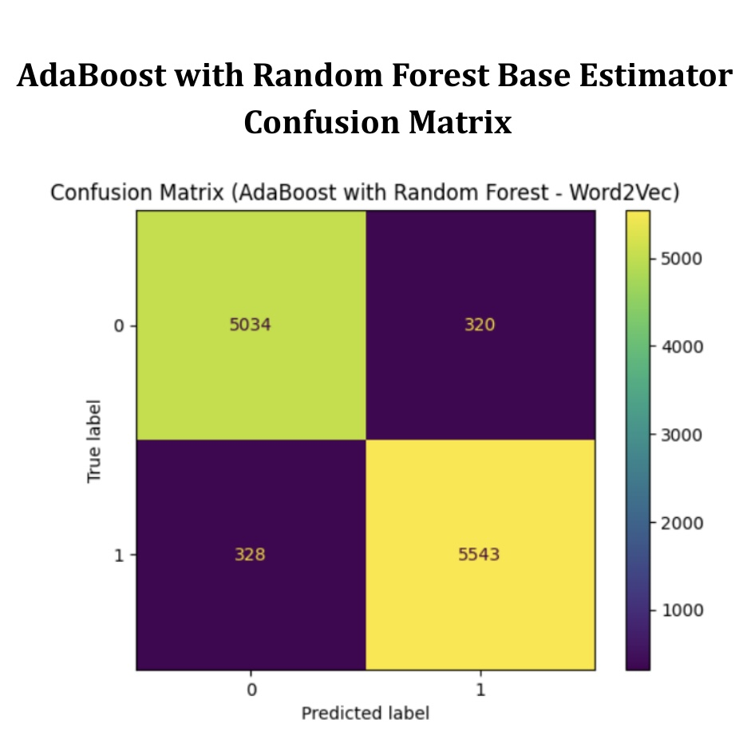
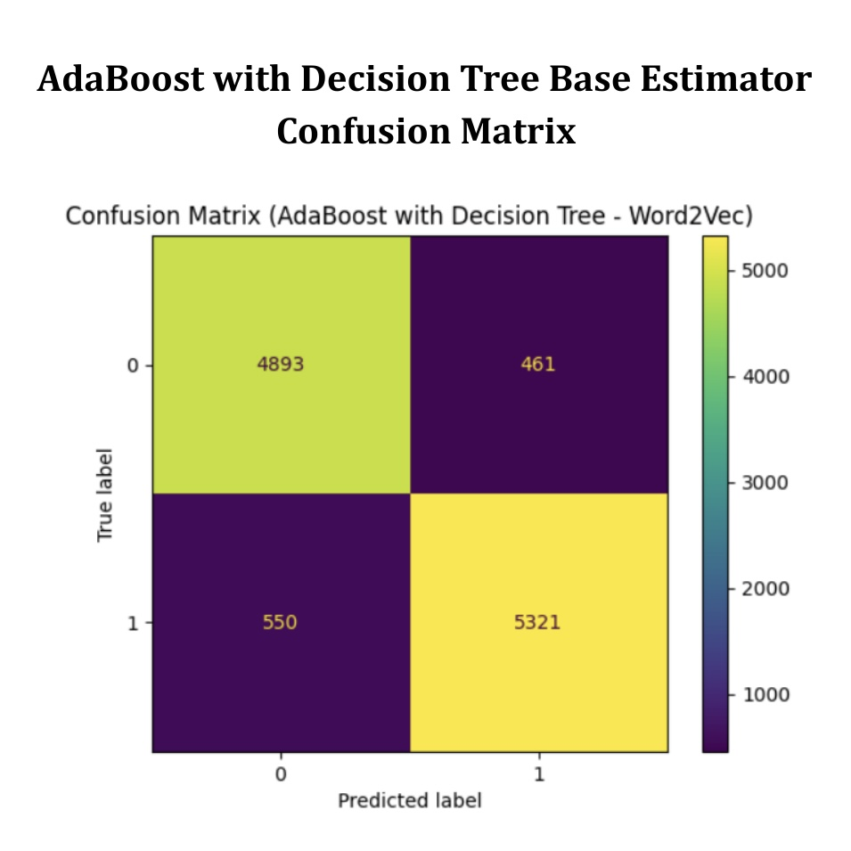

# Fake News Detection and Evaluation with Confusion Matrix

> Developed during the Autumn Internship at the **Indian Statistical Institute (ISI), Kolkata**, under the mentorship of the **IDEAS Technological Innovation Hub** (Institute of Data Engineering, Analytics, and Science Foundation). This project implements a machine learning approach to detect and evaluate fake news articles, emphasizing interpretability, robustness, and the ethical application of AI in sensitive domains.

---

## Project Overview

The exponential spread of misinformation online poses a serious threat to journalism, democratic processes, and public trust. This project implements a **comprehensive machine learning pipeline** to identify fake news. The pipeline includes **text preprocessing, feature engineering, supervised learning models, and rigorous evaluation** using confusion matrices and standard metrics.

**Key Outcome:** The **Random Forest classifier with TF-IDF (Term Frequency-Inverse Document Frequency) vectorization** achieved **99.14% accuracy and an F1-score of 0.992**, demonstrating the effectiveness of ensemble learning combined with carefully engineered features.

> Beyond numerical performance, this project emphasizes understanding model behavior, misclassification patterns, and the ethical implications of AI in misinformation detection.

---

## Dataset Overview

The project uses a **curated dataset of fake and true news articles**, ensuring diversity and representativeness:

| Dataset Type | Number of Articles | Shape (rows × columns) | Retained Columns |
| --- | --- | --- | --- |
| Fake News | 23,481 | (23,481 × 5) | `Label`, `text`, `class` |
| True News | 21,417 | (21,417 × 5) | `Label`, `text`, `class` |
| **Combined** | 44,898 | (44,898 × 5) | `Label`, `text`, `class` |

### Descriptive Insights

- **Label Distribution:**  
    - `1` = Fake news, `0` = True news.  
    - Balanced representation supports robust supervised learning.
- **Category Distribution:**  
    - PoliticsNews: 23.7% of articles  
    - WorldNews: 22.2% of articles  
    - Fake news subset includes a unique “News” category (22%) exclusive to fake articles.
- **Observations:**  
    - The prevalence of political and world news in both datasets highlights the **importance of context** for classification.  
    - The unique “News” category in fake news may provide patterns for model differentiation.

> This analysis informs preprocessing, feature engineering, and model selection, ensuring meaningful learning from textual patterns.

---

## Project Objectives

1. Develop a **machine learning classifier capable of distinguishing true and fake news**.  
2. Implement a **structured preprocessing workflow**: cleaning, normalization, and labeling.  
3. Evaluate the **impact of different feature representations**:  
    - **Word2Vec embeddings:** semantic and contextual understanding of words.  
    - **TF-IDF vectors:** statistical importance of words to distinguish fake from true news.  
4. Conduct **rigorous evaluation** using accuracy, precision, recall, F1-score, and confusion matrices.  
5. Identify **the most reliable model** for practical deployment and interpretability.

> Focus is not just on accuracy, but on understanding error patterns and ethical deployment of AI.

---

## Technology Stack

- **Programming:** Python 3.12 (Google Colab environment)  
- **Libraries:**  
    - `pandas`, `numpy` – data handling  
    - `scikit-learn` – ML models & evaluation  
    - `gensim` – Word2Vec embeddings  
    - `matplotlib`, `seaborn` – visualization  
    - `pickle` – model persistence  

---

## Methodology

### Data Preprocessing

- Removed null entries, duplicates, and irrelevant fields.  
- Labeled articles numerically: `0` = True, `1` = Fake.  
- Standardized text with `wordopt()` function to remove noise, URLs, punctuation, and special characters.

### Feature Engineering

| Technique | Description | Significance |
| --- | --- | --- |
| Word2Vec | Dense embeddings capturing semantic relationships between words | Useful for understanding nuanced context and linguistic similarity |
| TF-IDF | Sparse vector representation highlighting unique and statistically important words | Critical for differentiating fake news based on distinct word patterns |

### Model Development

| Model | Description | Research Significance |
| --- | --- | --- |
| Logistic Regression | Baseline linear model | Provides a reference point for performance |
| Random Forest | Ensemble of decision trees | Improves robustness and reduces overfitting |
| AdaBoost | Boosting technique combining weak learners | Enhances prediction by focusing on difficult cases |

### Evaluation Strategy

- **Metrics:** Accuracy, Precision, Recall, F1-score  
- **Confusion Matrices:** Visualize misclassifications to understand patterns in errors

> This multi-metric evaluation ensures evidence-based model selection.

---

## Cumulative Analysis Table

| Model | Feature Representation | Accuracy | Precision | Recall | F1-Score |
| --- | --- | --- | --- | --- | --- |
| Logistic Regression | Word2Vec | 94.41% | 0.951 | 0.942 | 0.946 |
| Random Forest | Word2Vec | 94.34% | 0.946 | 0.946 | 0.946 |
| Logistic Regression | TF-IDF | 98.49% | 0.986 | 0.985 | 0.985 |
| Random Forest | TF-IDF | **99.14%** | **0.994** | **0.990** | **0.992** |
| AdaBoost (Random Forest Base) | Word2Vec | 94.23% | 0.945 | 0.944 | 0.945 |
| AdaBoost (Decision Tree Base) | Word2Vec | 90.99% | 0.920 | 0.906 | 0.913 |

**Explanation:**  

- TF-IDF provides better performance than Word2Vec, likely because **statistical importance of words is more critical than semantic similarity** for fake news.  
- Random Forest with TF-IDF is both **accurate and interpretable**, making it suitable for practical applications.  
- Confusion matrices confirm **low misclassification rates**, validating model reliability.

---

### Result Visualizations

Below are the confusion matrices and result plots corresponding to the models evaluated in the cumulative analysis:

- **Logistic Regression (Word2Vec)**  
  

- **Random Forest (Word2Vec)**  
  

- **Logistic Regression (TF-IDF)**  
  

- **Random Forest (TF-IDF)**  
  

- **AdaBoost (Random Forest Base, Word2Vec)**  
  

- **AdaBoost (Decision Tree Base, Word2Vec)**  
  

### Video Demonstration

Watch the project walkthrough video here:  
[Fake News Detection and Evaluation with Confusion Matrix](./video/Fake%20News%20Detection%20and%20Evaluation%20with%20Confusion%20Matrix.mp4)

> Click the video to play the demonstration directly from the repository.

## Contributions

- Full, reproducible pipeline from **data ingestion to model evaluation**  
- Comparative study of **feature representations and classifiers**  
- Highlighted **ensemble methods with TF-IDF** as the optimal approach  
- Established foundation for **advanced research, deployment, and ethical evaluation**

---

## Acknowledgements

Special thanks to the **IDEAS Technological Innovation Hub (Institute of Data Engineering, Analytics, and Science Foundation)** and mentors:

- **Mr. Agnimitra Biswas** – CEO, IDEAS–TIH  
- **Mr. Diptendu Dutta** – Technology Lead, IDEAS–TIH  
- **Dr. Sujoy K. Biswas** – Head of Research & Innovation, IDEAS–TIH  
- **Ms. Bidisha Dobe** – Operations & Training Manager, IDEAS–TIH  
- **Mr. Koustab Ghosh** – Python and Machine Learning Training  

> Their guidance, mentorship, and training in Python, Machine Learning, and Large Language Models made this project possible.

---

## References

1. **Fake News Detection Dataset** – Kaggle: [https://www.kaggle.com/fake-news-detection-datasets](https://www.kaggle.com/fake-news-detection-datasets)  
   *Used as the primary dataset for training and evaluating fake news classifiers.*

2. **Word2Vec Training Data: BBC News Dataset** – Kaggle: [https://www.kaggle.com/datasets/hgultekin/bbcnewsarchive](https://www.kaggle.com/datasets/hgultekin/bbcnewsarchive)  
   *Used to train Word2Vec embeddings for semantic text representation.*

3. Mikolov, T., Chen, K., Corrado, G., & Dean, J. (2013). *Efficient Estimation of Word Representations in Vector Space*. [arXiv link](https://arxiv.org/abs/1301.3781)  
   *Introduces the Word2Vec model applied in this project.*

4. Pedregosa, F., Varoquaux, G., Gramfort, A., et al. (2011). *Scikit-learn: Machine Learning in Python*. Journal of Machine Learning Research, 12, 2825–2830. [Journal Link](https://jmlr.org/papers/v12/pedregosa11a.html)  
   *Scikit-learn is the primary library used for implementing Logistic Regression, Random Forest, and other ML models in this project.*
